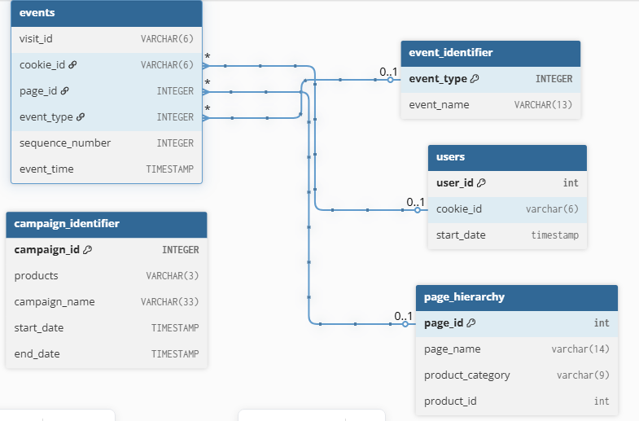

## Section A — Entity Relationship Diagram



### Relationships
| From Table | To Table | Via Column |
|---|---|---|
| events | users | cookie_id |
| events | page_hierarchy | page_id |
| events | event_identifier | event_type |

### Key Finding — campaign_identifier
The `products` column in `campaign_identifier` stores denormalized product ranges as strings (e.g. `"1-3"` = product IDs 1, 2, 3). This creates a **hidden relationship** with `page_hierarchy.product_id` that cannot be enforced as a foreign key.

In a properly normalized database a junction table would exist:
```
campaign_products
- campaign_id  [FK → campaign_identifier]
- product_id   [FK → page_hierarchy]
```
Because of this — `campaign_identifier` appears standalone in the ERD with no direct relationship lines.
